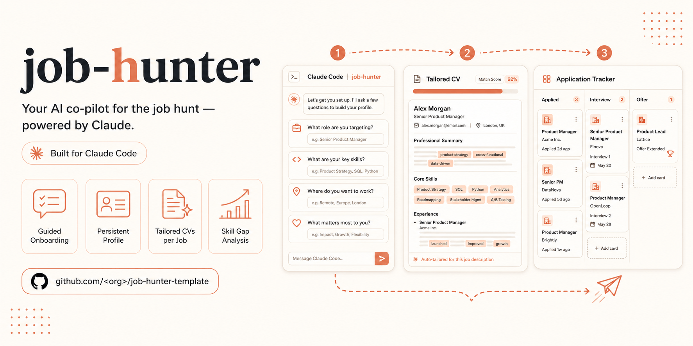

# job-hunter — template



Personal AI job-search assistant, built as a **Claude Skills** package on a
single **GitHub repository**. Guided onboarding, a persistent profile,
multi-source sourcing, fit evaluation, tailored CVs, and application
tracking — all version-controlled, inspectable, and correctable.

> **This is the `template` branch.** It contains no personal data: it's the
> clean base to clone and start *your own* system. All you need is an
> onboarding conversation and your CV — no file to configure by hand.

Full documentation below, in English and Italian.

<details>
<summary><b>🇬🇧 English</b></summary>

## What the system does

| Skill | Role |
|---|---|
| `agent-config` | **Onboarding**: from your CV to your first search intent, through routine activation. **Start here.** |
| `job-search-profile` | Search editor after onboarding: intents, defaults/overrides, lifecycle (create/pause/archive). |
| `job-alert-config` | Step-by-step instructions to set up LinkedIn/Indeed alerts from your intents. |
| `job-alert-tuner` | Tuning metrics from the `source-log`: volume, overlap, noise per search. |
| `role-fit` | Evaluates the fit between a job description and your profile; saves a structured outcome. |
| `cv-tailoring` | Generates a CV (PDF), cover letter, and recruiter message from your profile; never fabricates data. |
| `application-tracker` | Application tracker in `applications/`: promotion, status updates, follow-ups, replies via Gmail. |
| `job-watch` | The batch routine: collects, deduplicates, filters, evaluates, pre-generates materials in staging, and sends the digest. |

## Getting started (from scratch)

1. **Clone this branch** and open it in **Claude Code Desktop**:
   ```bash
   git clone --branch template <your-fork-url> job-hunter
   ```
   Tip: create your **own private repository** from the template (see
   *Privacy* below) and clone that instead.

2. **Open the folder in Claude Code Desktop.** You don't need to know git or
   open files by hand — the agent always does it.

3. **Start the onboarding by talking in chat**, in natural language. You
   don't need to name any skill — just state your intent. Examples:
   > *"let's set up the job search system"*
   > *"help me set up job hunting, here's my CV"*

   This triggers `agent-config`, which ingests your CV, asks a few questions
   about constraints and preferences (relocation, remote work, compensation,
   languages…), and writes `master-profile.yaml` + your first intent under
   `searches/`. **No field needs to be filled in by hand.**

4. **Set up the alerts and activate the routine** when onboarding suggests
   it (instructions generated by `job-alert-config`).

From there on you work in chat with natural language: *"evaluate this job
posting"*, *"make me a CV for this position"*, *"I applied to X"*, *"where do
my applications stand?"*.

### The system guides you if you skip onboarding

Every functional skill has a **readiness guard**: if you use it before its
prerequisite is configured (e.g. asking for a tailored CV without a profile
yet), the skill **doesn't fail and doesn't make things up** — it recognizes
what's missing and redirects you to the right step with a specific message.
If you open a session on a system that isn't configured yet, the agent
itself will suggest onboarding. You can't "break it" by starting from the
wrong place.

## Repo layout

```
job-hunter/
├─ master-profile.yaml   # WHO you are (created by onboarding — absent in the template)
├─ routine-config.yaml   # routine operational config (Gmail label, cadence)
├─ searches/             # WHAT you're looking for (empty in the template; onboarding populates it)
├─ role-fit/             # JD↔profile evaluations (empty in the template)
├─ applications/         # repo-first application tracking (empty in the template)
├─ source-log/           # routine telemetry (empty in the template)
├─ staging/              # pre-processed offers awaiting review (empty)
├─ digests/              # generated digests (empty in the template)
├─ scripts/              # utilities (e.g. digest delivery: SMTP if possible, otherwise draft)
├─ docs/                 # operational runbooks (e.g. GDPR deletion)
├─ .claude/skills/       # the system's skills
└─ CLAUDE.md             # persistent context for the agent
```

Operational folders arrive **empty** (a `.gitkeep` preserves the structure):
they fill up as you use the system.

## What you need to connect

- **Claude Code Desktop** (file + git writes happen here). Requires a **paid
  Claude plan** (or pay-as-you-go API access): the full cycle — onboarding,
  autonomous routine, evaluations, CV generation — uses agentic capabilities
  that claude.ai's free tier doesn't cover, and its GitHub connector is
  read-only anyway (it can't write/commit). Plan for this before starting,
  not midway through onboarding.
- An **Indeed connector** and a **Gmail connector** (for sourcing, and for
  reading alerts / preparing drafts). You connect them from connector
  settings; onboarding tells you when they're needed. Note: the allowlist in
  `.claude/settings.json` doesn't list connector IDs — those depend on your
  account and get approved when you connect your own.

## The three things that always stay manual (by design)

1. **Setting up** LinkedIn/Indeed alerts (one-time, behind login).
2. **Sending** applications and follow-ups (mandatory human review).
3. **Promoting** an offer to an application (no application is ever created
   on its own).

Everything else — sourcing, evaluation, pre-generation, deadline tracking —
is automatic.

## Privacy

As soon as you complete onboarding, the repo starts containing **real
personal data** (email, phone, compensation, companies you apply to). **Keep
your repo private.** Nothing automatically detects a visibility change:
check it yourself. To delete a personal data point from the *entire* git
history (not just HEAD), see `docs/runbook-cancellazione-gdpr.md`.

## Design decisions

The closed decisions that constrain the system (D1–D8) are in
[`CLAUDE.md`](CLAUDE.md): personal-first user, single profile with nested
intents, mandatory human review before any send, batch staging with manual
send, storage in the repo, monthly JSONL log, interaction in Claude Code
Desktop, repo-first application tracker.

</details>

<details>
<summary><b>🇮🇹 Italiano</b></summary>

## Cosa fa il sistema

| Skill | Ruolo |
|---|---|
| `agent-config` | **Onboarding**: dal tuo CV al primo intento di ricerca, fino all'attivazione della routine. **Parti da qui.** |
| `job-search-profile` | Editor delle ricerche dopo l'onboarding: intenti, defaults/override, ciclo di vita (crea/pausa/archivia). |
| `job-alert-config` | Istruzioni passo-passo per impostare gli alert LinkedIn/Indeed dai tuoi intenti. |
| `job-alert-tuner` | Metriche di tuning dal `source-log`: volume, overlap, rumore per ricerca. |
| `role-fit` | Valuta il fit tra una JD e il tuo profilo; salva un esito strutturato. |
| `cv-tailoring` | Genera CV (PDF), cover letter e DM al recruiter dal tuo profilo; mai fabbrica dati. |
| `application-tracker` | Tracker delle candidature in `applications/`: promozione, avanzamenti, follow-up, risposte via Gmail. |
| `job-watch` | La routine batch: raccoglie, deduplica, filtra, valuta, pre-genera i materiali in staging e manda il digest. |

## Come iniziare (da zero)

1. **Clona questo branch** e aprilo in **Claude Code Desktop**:
   ```bash
   git clone --branch template <url-del-tuo-fork> job-hunter
   ```
   Consiglio: crea un **tuo repository privato** dal template (vedi *Privacy*
   più sotto) e clona quello.

2. **Apri la cartella in Claude Code Desktop.** Non serve conoscere git né
   aprire file a mano: lo fa sempre l'agente.

3. **Avvia l'onboarding parlando in chat**, con frasi naturali. Non devi
   nominare nessuna skill: basta l'intento. Esempi:
   > *"iniziamo a configurare il sistema di ricerca lavoro"*
   > *"aiutami a impostare il job hunting, ecco il mio CV"*

   Si attiva `agent-config`, che ingerisce il CV, ti fa qualche domanda su
   vincoli e preferenze (trasferimento, remoto, retribuzione, lingue…) e
   scrive `master-profile.yaml` + il tuo primo intento in `searches/`.
   **Nessun campo va compilato a mano.**

4. **Imposta gli alert e attiva la routine** quando l'onboarding te lo
   propone (istruzioni generate da `job-alert-config`).

Da lì in poi lavori in chat con frasi naturali: *"valuta questo annuncio"*,
*"fammi il CV per questa posizione"*, *"mi sono candidato a X"*, *"a che punto
sono le candidature?"*.

### Il sistema ti guida se salti l'onboarding

Ogni skill funzionale ha una **guardia di readiness**: se la usi prima di
aver configurato il suo prerequisito (es. chiedi un CV su misura senza avere
ancora un profilo), la skill **non fallisce e non inventa** — riconosce cosa
manca e ti reindirizza al passo giusto con un messaggio specifico. Se apri
una sessione su un sistema non ancora configurato, l'agente stesso ti
propone l'onboarding. Non puoi "romperlo" partendo dal punto sbagliato.

## Layout del repo

```
job-hunter/
├─ master-profile.yaml   # CHI sei (creato dall'onboarding — assente nel template)
├─ routine-config.yaml   # config operativa della routine (etichetta Gmail, cadenza)
├─ searches/             # COSA cerchi (vuota nel template; onboarding la popola)
├─ role-fit/             # valutazioni JD↔profilo (vuota nel template)
├─ applications/         # candidature repo-first (vuota nel template)
├─ source-log/           # telemetria della routine (vuota nel template)
├─ staging/              # offerte pre-lavorate in attesa di revisione (vuota)
├─ digests/              # digest generati (vuota nel template)
├─ scripts/              # utility (es. consegna digest: SMTP se possibile, altrimenti bozza)
├─ docs/                 # runbook operativi (es. cancellazione GDPR)
├─ .claude/skills/       # le skill del sistema
└─ CLAUDE.md             # contesto permanente per l'agente
```

Le cartelle operative arrivano **vuote** (un `.gitkeep` ne mantiene la
struttura): si riempiono man mano che usi il sistema.

## Cosa serve collegare

- **Claude Code Desktop** (le scritture su file + git avvengono qui).
  Richiede un **piano Claude a pagamento** (o accesso API a consumo): il
  ciclo completo — onboarding, routine autonoma, valutazioni, generazione CV
  — usa capacità agentiche che il tier gratuito di claude.ai non copre, ed è
  comunque sola-lettura sul connettore GitHub (non può scrivere/committare).
  Mettilo in conto prima di iniziare, non a metà onboarding.
- Un **connettore Indeed** e un **connettore Gmail** (per il sourcing e per
  leggere gli alert / preparare bozze). Li colleghi dalle impostazioni
  connettori; l'onboarding ti dice quando servono. Nota: l'allowlist in
  `.claude/settings.json` non elenca ID di connettore — dipendono dal tuo
  account e vengono approvati quando colleghi i tuoi.

## Le tre cose che restano sempre manuali (per costruzione)

1. **Impostare gli alert** LinkedIn/Indeed (una tantum, dietro login).
2. **Inviare** candidature e follow-up (revisione umana obbligatoria).
3. **Promuovere** un'offerta a candidatura (nessuna candidatura nasce da
   sola).

Tutto il resto — sourcing, valutazione, pre-generazione, tracking delle
scadenze — è automatico.

## Privacy

Appena completi l'onboarding, il repo inizia a contenere **dati personali
reali** (email, telefono, retribuzione, aziende a cui ti candidi). **Tieni
privato il tuo repo.** Nulla rileva automaticamente un cambio di visibilità:
verificalo tu. Per cancellare un dato personale da *tutta* la storia git
(non solo dall'HEAD), vedi `docs/runbook-cancellazione-gdpr.md`.

## Decisioni di design

Le decisioni chiuse che vincolano il sistema (D1–D8) sono in
[`CLAUDE.md`](CLAUDE.md): utente personale-first, profilo unico con intenti
annidati, revisione umana obbligatoria prima di ogni invio, batch in staging
con invio manuale, storage nel repo, log JSONL mensile, interazione in
Claude Code Desktop, tracker candidature repo-first.

</details>
